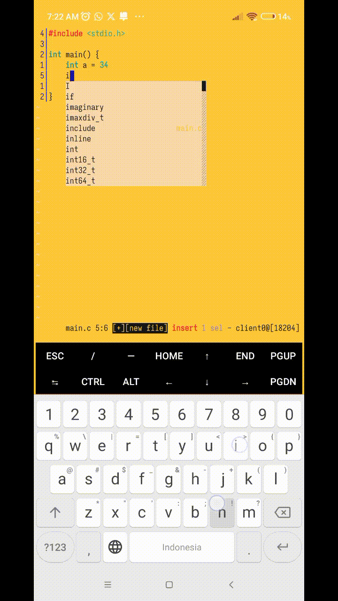

# COMPILER MODE for KAKOUNE



This plugin heavely inspired by Emacs's Compiler Mode. If you know the Rusian Twitch streamer / Youtube, he use that in every single his Programming Session.

## Requirement 

You need [Luar](https://github.com/gustavo-hms/luar) because this plugin need it.
## Instalation

Just copy compiler-mode.kak to your autoload directory and paste this command to your kakrc file:

```text
require-module compcmd
```
tha's it.

## Usage

All the key binding are in user space (in normal mode you press 'space' key).

### Start compilation (space-c)
On the normal mode you press <space>-c and enter your compilation/run script, like: "cc main.c -o main" or "make".

### Jump to error location (ret)
On the *compilation* buffer you put the cursor at error message (the line with filename, line, and etc.) then you press ret and you will jump to exact file and line and column (if there is column in error message).

Happy programmin! :)
